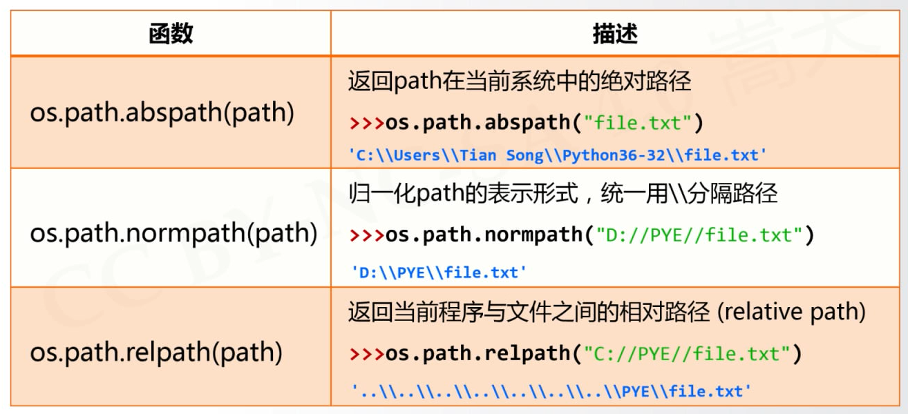
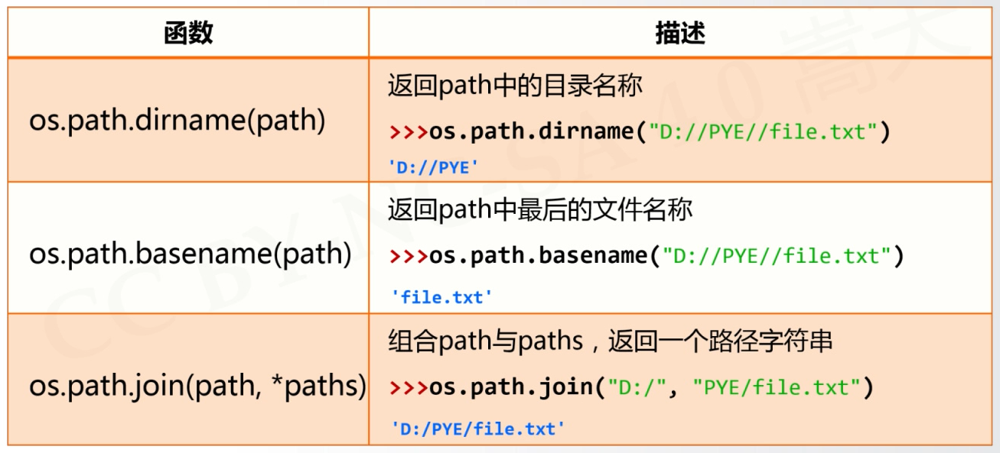
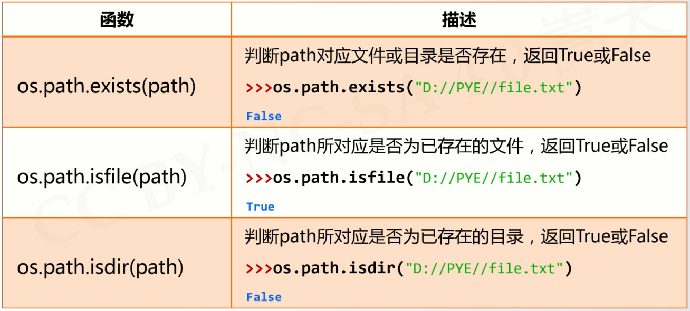
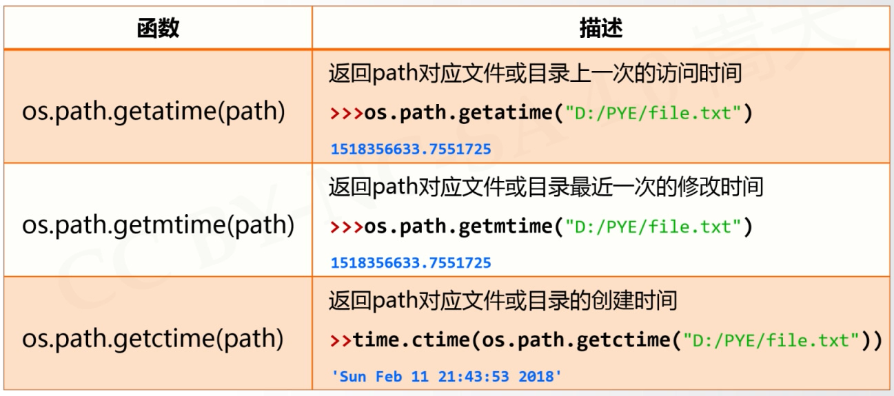
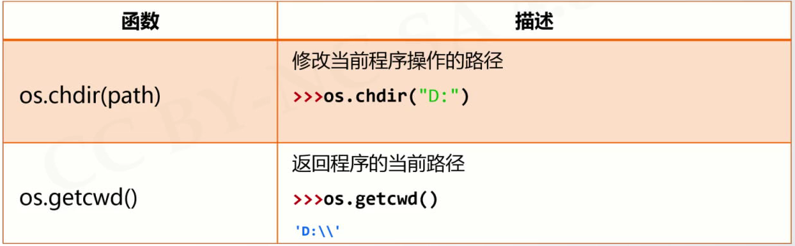

# os库
---
### 路径操作
##### 使用```import os.path```引入os子库





### 进程管理
##### 使用```import os```引入os库
os.system(<程序路径> <打开文件>)*==(中间有空格)==*
```python{class=line-numbers cmd=True}
import os
os.system("C:\Users\Future\AppData\Local\Programs\Microsoft VS Code\Code.exe C:\Users\Future\Desktop\Python\turtle2.py")
```


