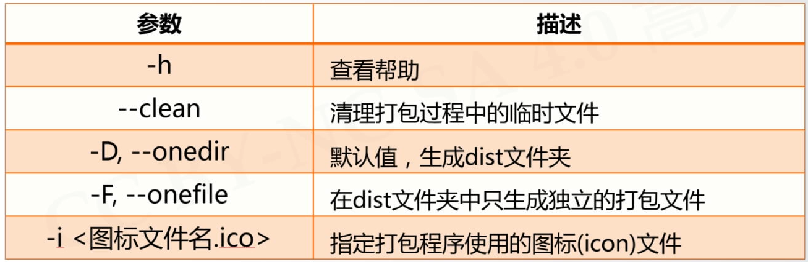

# pyinstaller库
---
### 安装
pip install pyinstaller
### 使用
用于将.py文件打包生成可执行文件


例如：
```pyinstaller -F .\DigitalPipe.py ``` 能够将文件打包成可执行文件
```pyinstaller -i image.ico -F .\DigitalPipe.py ``` 能够将文件打包成以image.ico为图标的可执行文件