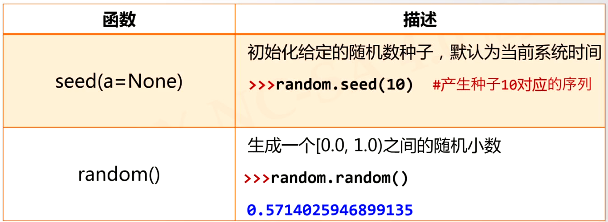
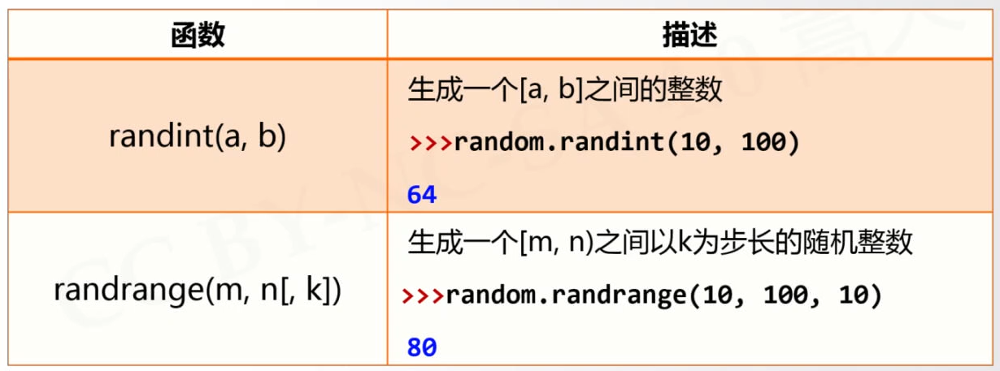
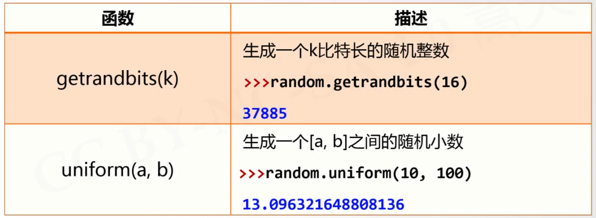
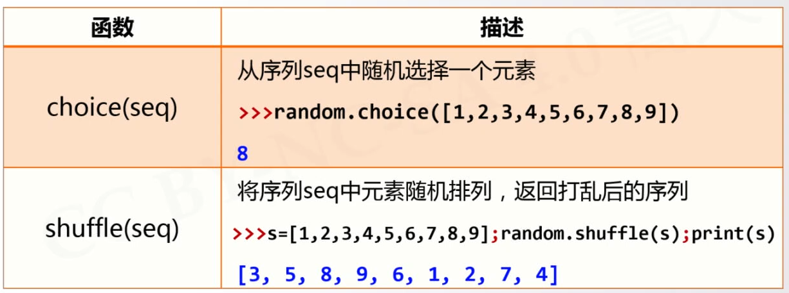

# random库
---
### 基本随机函数

[注]：seed 能够在后续复现随机数
      random 则不能在后续复现相同的随机数
```python{class=line-numbers cmd=True}
import random
random.seed(10)
num = random.random()
print(num)
random.seed(10) #使用相同的随机数种子能够实现复现
num2 = random.random()
print(num2)
```
### 拓展随机函数



```python{class=line-numbers cmd=True}
import random
random.seed(10)
num = random.random()
print(num)
num2 = random.random()
print(num2)
```
```python{class=line-numbers cmd=True}
import random
num1 = random.random()
num2 = random.randint(1,100)
num3 = random.randrange(10,100,10)
num4 = random.getrandbits(2)
num5 = random.uniform(1,100)
num6 = random.choice([1,2,3,4,5])
s = [1,2,3,6,9]
random.shuffle(s)
print(s)
print(num1)
print(num2)
print(num3)
print(num4)
print(num5)
print(num6)
```