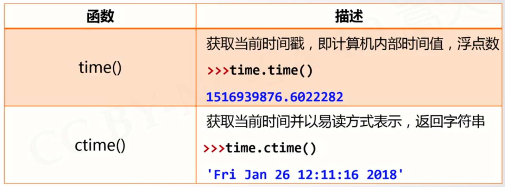
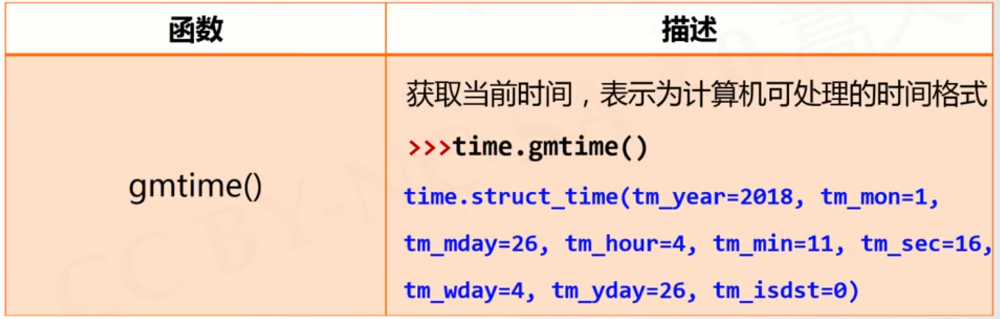
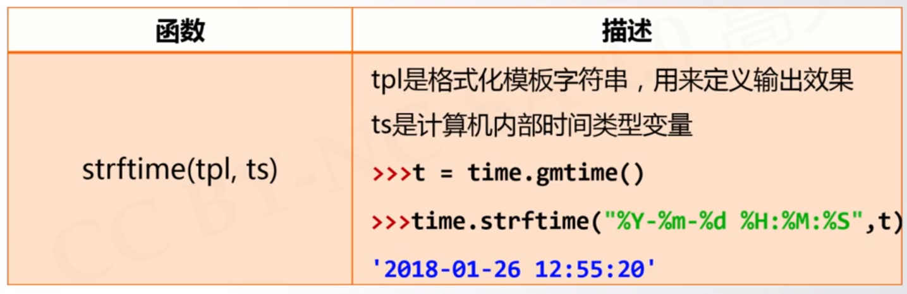
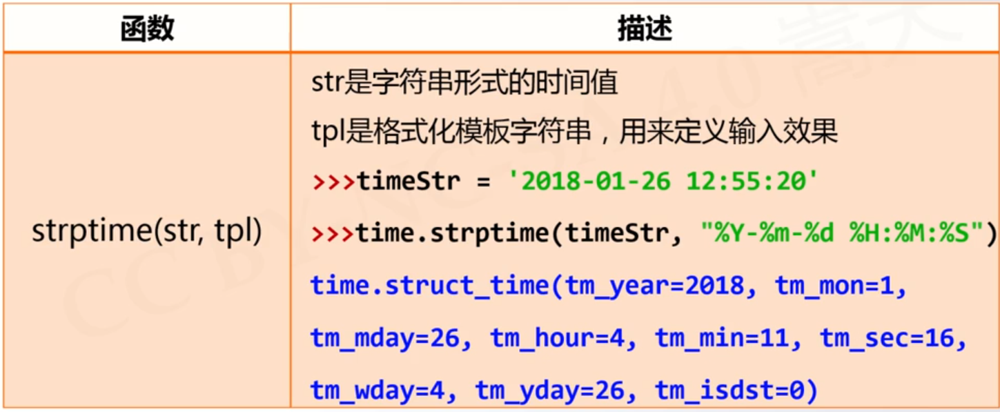
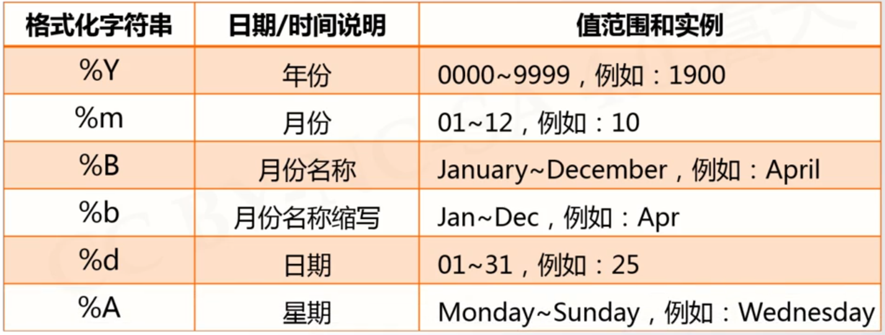
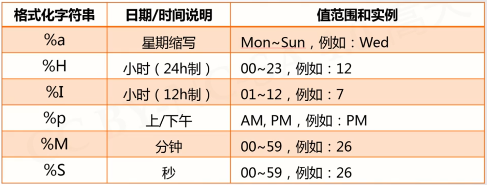
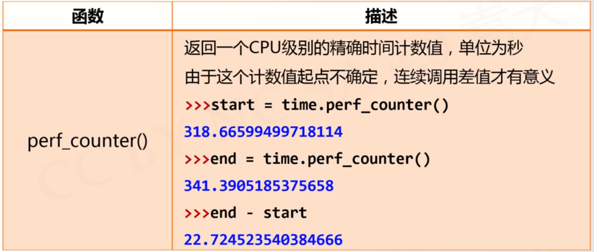

# Time库
---
### 三种时间格式


```python{class=line-numbers cmd=true}
import time
print(time.time())
print(time.ctime())
print(time.gmtime())
```
### 时间格式化





```python{class=line-numbers cmd=true}
import time
t = time.gmtime()
print(time.strftime("%Y-%m-%d %A %H:%M:%S",t))
```

### 程序计时

```python{class=line-numbers cmd=true}
import time
start = time.perf_counter()
end = time.perf_counter()
print((end-start)*10e6)
```
