 # 基础语法（Python）
---

 ## **运算部分**
 ### 1.保留字
 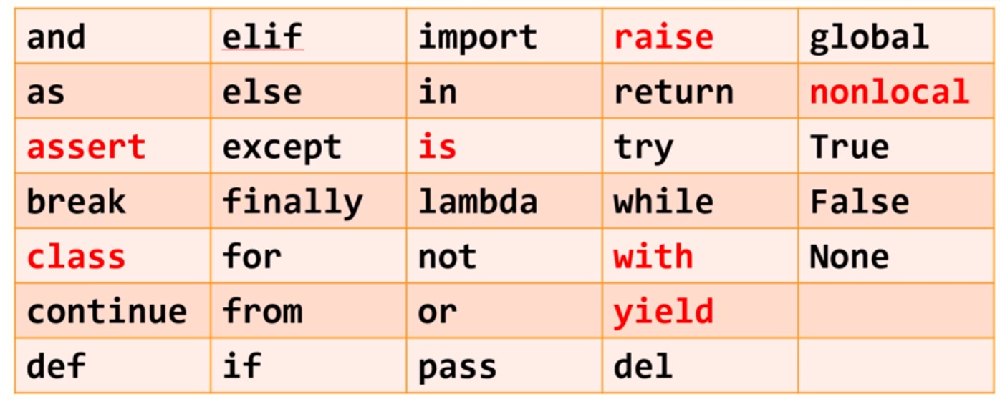

 ### 2.数值运算符号
 **一元操作符**

 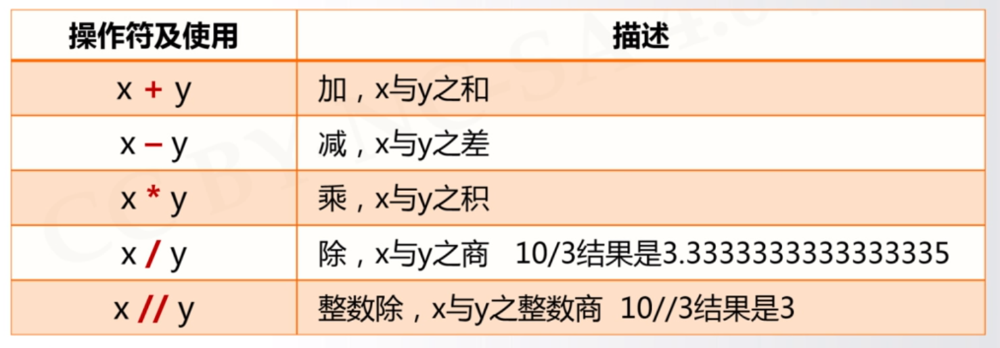
 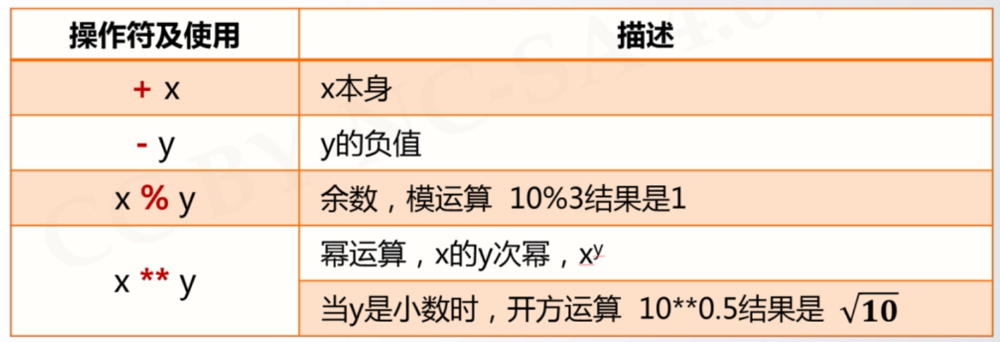

 **二元操作符**
 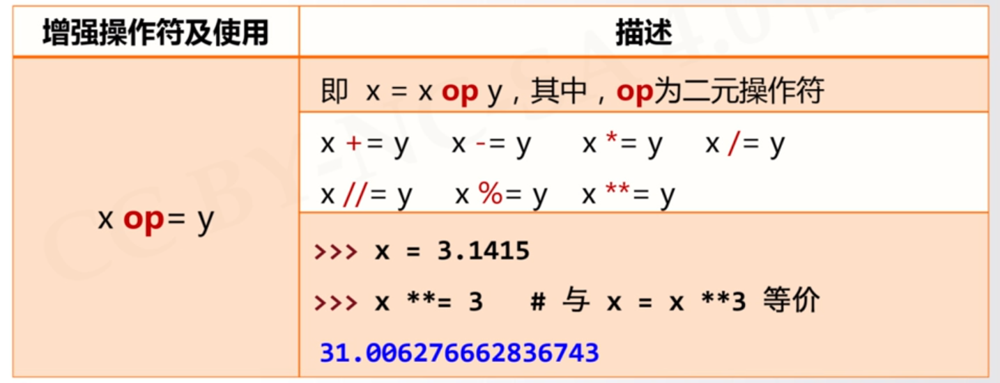

 ### 3.数字类型的关系

 **整数 -> 浮点数 -> 复数**

 ### 4.数值运算函数

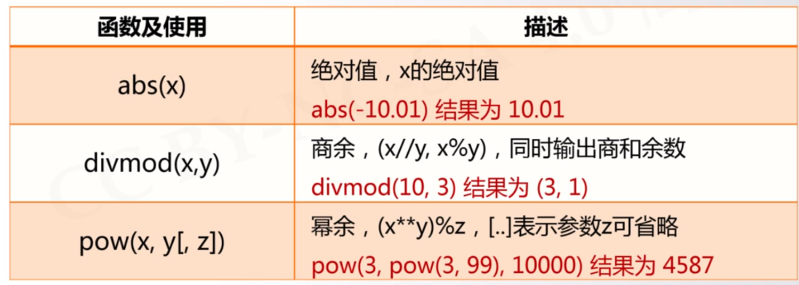
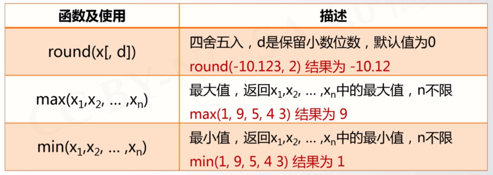
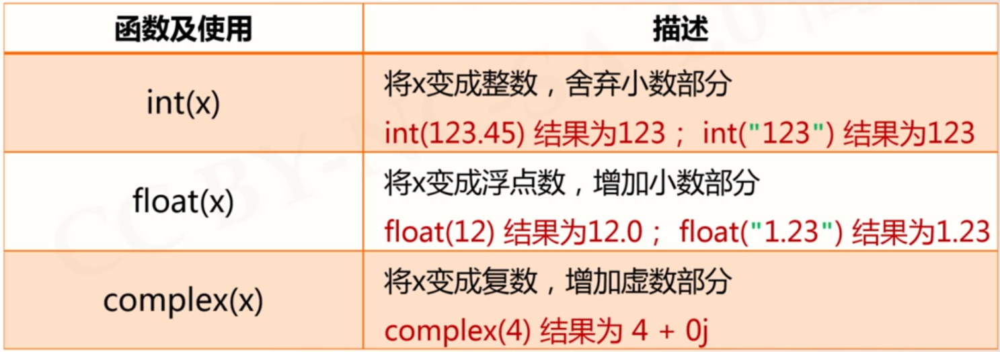

### 5.字符串
##### 字符串的表示
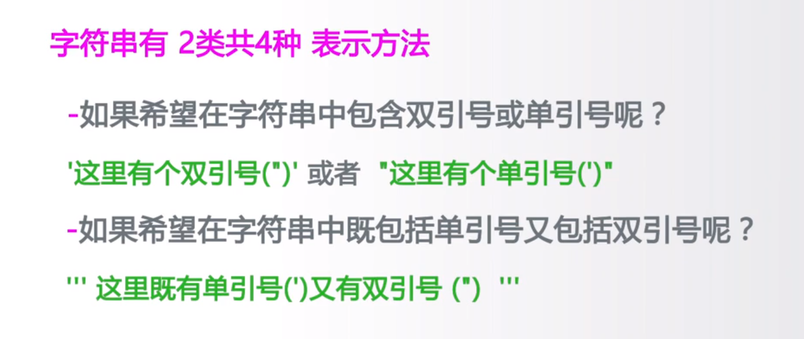
##### 字符串的序号
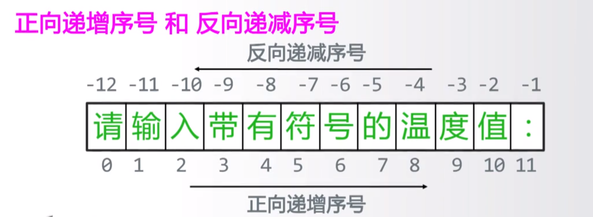
##### 字符串切片
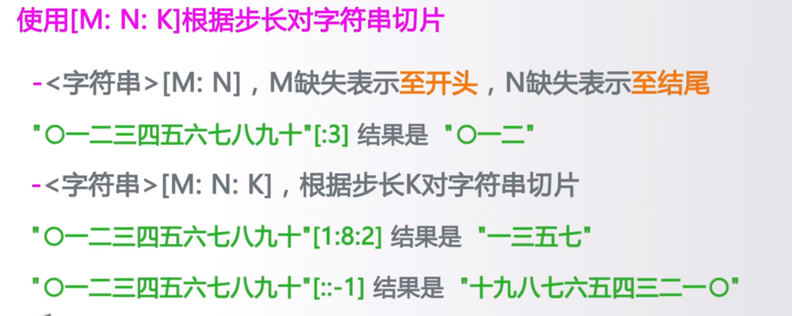
##### 转义字符
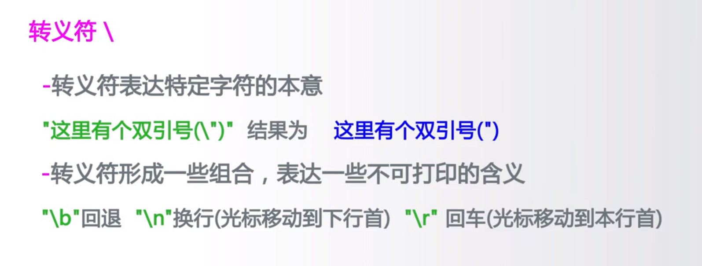
##### 字符串操作符
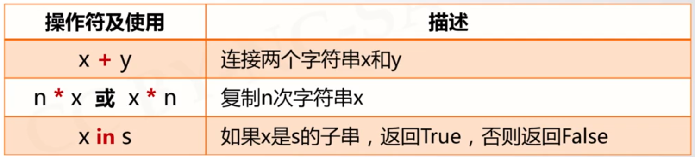
##### 字符串处理函数
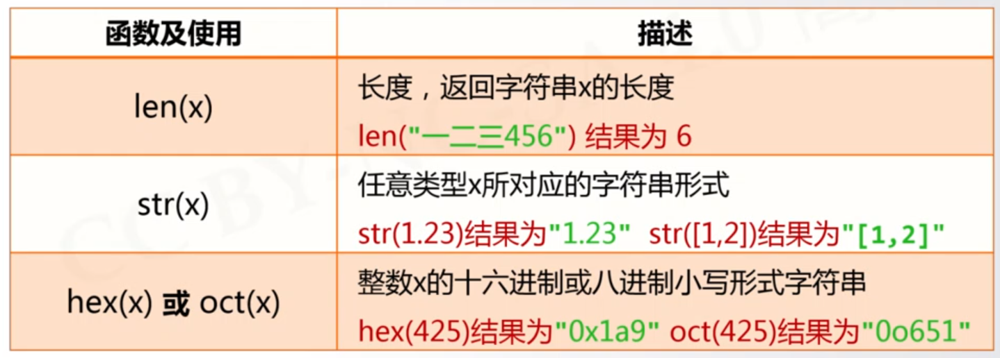
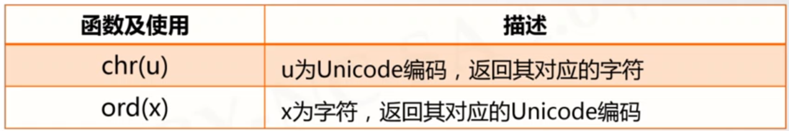

例如：以下代码可用于输出所有的星座符号
```python{class=line-numbers cmd=true}
for i in range(12):
    print(chr(9800+i),end="")
```
##### 字符串处理方法
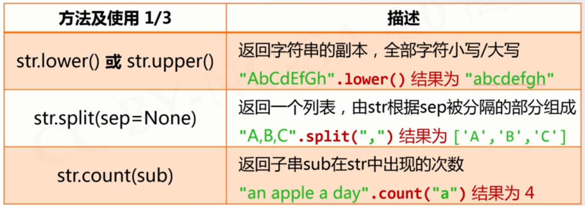
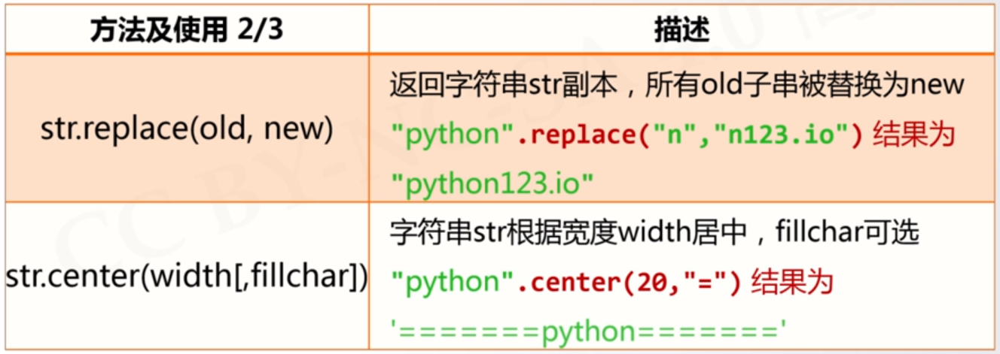
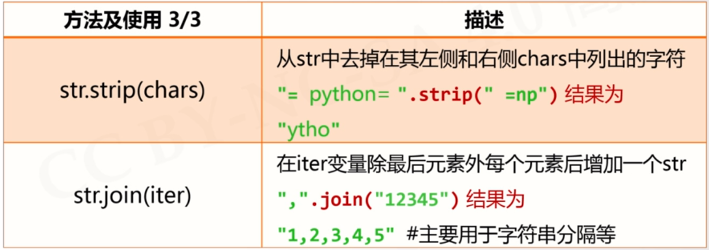
##### 字符串的格式化
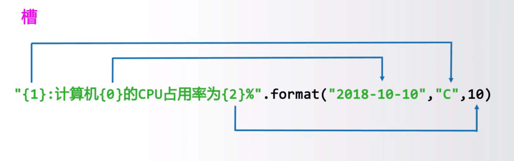
例如：一下代码可以按照参数序号输出
```python{class=line-numbers cmd=true}
A=1
print("{1}:Today is {2} and the time is {0}".format("21:47",A,"2022-02-02"))
```
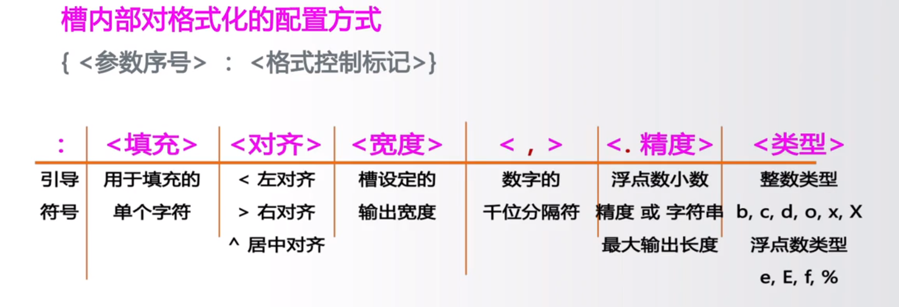
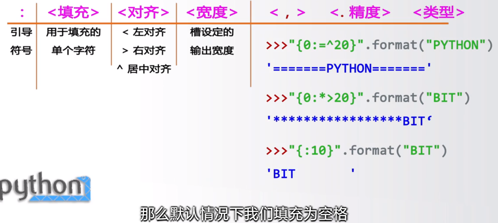


 ## 绘图部分
