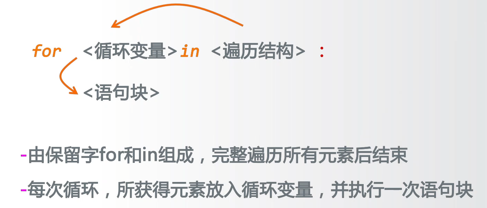
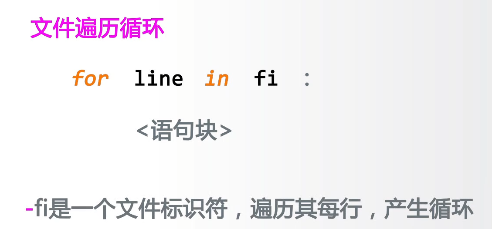
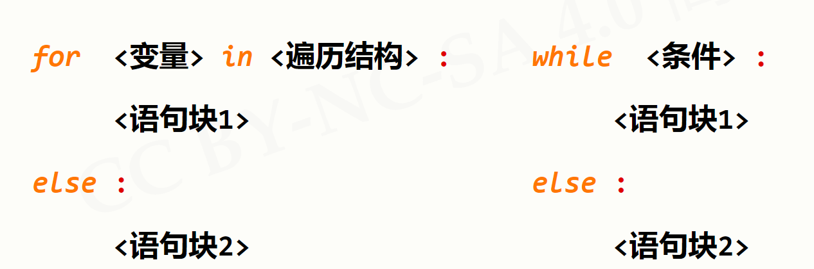
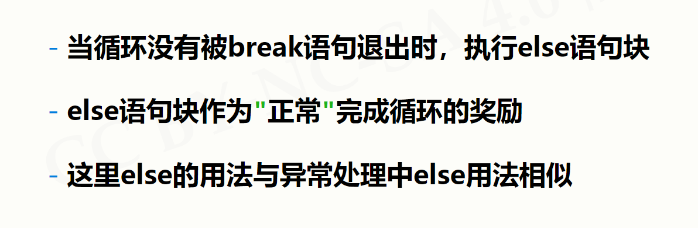

# 循环结构
---
### 遍历循环


### for ... in ... 结构

##### for i in range(M,N,K) / range(N) 

```python{class=line-numbers cmd=True}
N = 3
for i in range(N): #以1为步长，输出从0开始到N-1的数字
    print(i)
```
```python{class=line-numbers cmd=True}
N = 10
M = 2
K = 3
for i in range(M,N,K): #以K为步长，输出从M开始到N-1的数字
    print(i)
```
##### for c in str 字符串遍历循环
```python{class=line-numbers cmd=True}
str = 'Hello AI World!'
for c in str: 
    print(c,end=" ")
```

##### for item in [str] 列表遍历循环
```python{class=line-numbers cmd=True}
for item in ["Hello","AI","World"]:
    print(item,end=",")
```

##### 文件遍历循环


### while 无限循环
用法与C语言雷同
出现死循环可采用Ctrl+C退出

### break和continue
 break 跳出单层全部循环
 continue 跳出单层本次循环

 ### 循环与else


例如：
```python{class=line-numbers cmd=True}
for c in "PYTHON":
    if c == "T":
        continue
    print(c,end="")
else:
    print(" Exit Normal") #没有遇到break正常执行else
for c in "PYTHON":
    if c == "T":
        break
    print(c,end="")
else:
    print(" Exit Normal") #遇到break不再执行else
```
