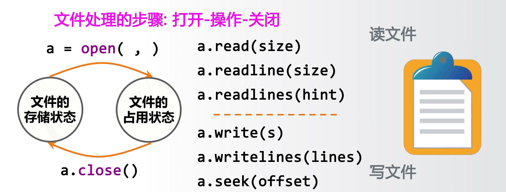
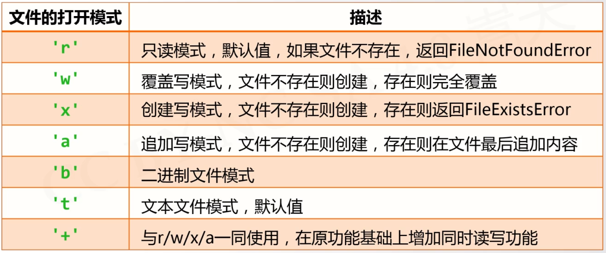
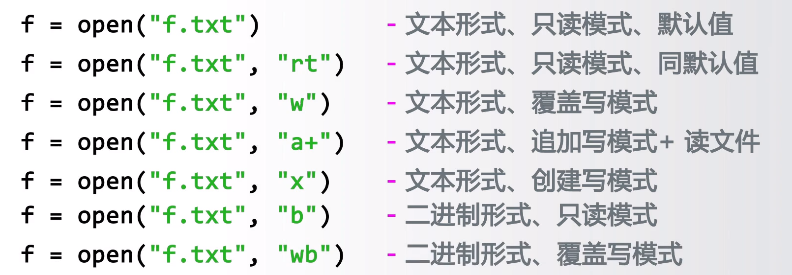
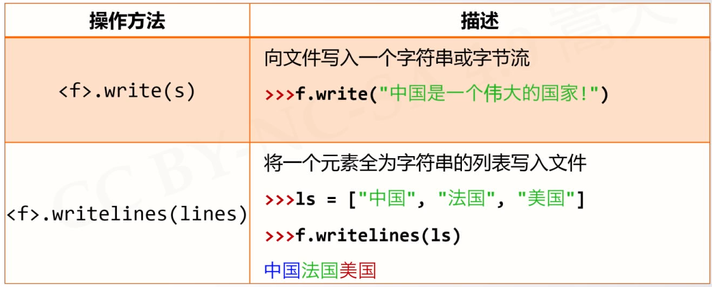
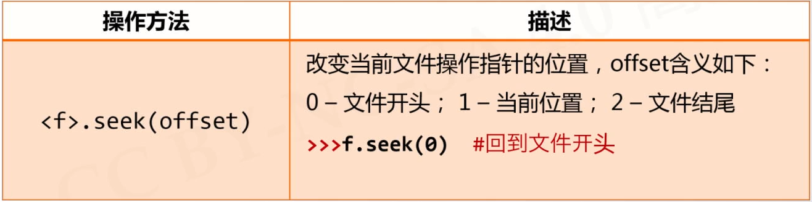

# 文件操作
---
### 文件的处理


#### 文件打开
```{class=line-numbers}
<变量名称> = open(<文件名>,<打开模式>)
<文件名> 是文件的路径和名称,在相同目录下的文件可以省略路径
<打开模式> 可以是文本或者二进制 采用读或者写
```
##### 绝对路径:
*[注]* 在Python中的反斜杠是转译字符,而Windows平台下的默认的文件路径为反斜杠,因此书写绝对路径时要采用:```/(斜杠)```替代```\(反斜杠)```,如D盘目录下Future文件夹的Hello.txt文件,应写作:
```{class=line-numbers}
Windows: D:\Future\Hello.txt
Python: "D:/Future/Hello.txt" 或者 "D:\\Future\\Hello.txt"
```
##### 相对路径
如该程序存储在D盘根目录下,可以用```./```来在相同目录下搜索文件,如上面文件的位置可写作```./Future/Hello.txt```
当位于相同目录时,可直接写作```Hello.txt```

##### 文件打开模式



##### 文件关闭
```<变量名>.close```

----

#### 文件的读取

##### 遍历全文本
###### 通用方式
适用于小文件
 ```python{class=line-numbers}
fname = input("请输入要打开的文件名称:")
fo = open(fname,"r")
txt = fo.read()
#对全文txt进行处理
fo.close()
 ```
适用于大文件
 ```python{class=line-numbers}
 fname = input("请输入要打开的文件名称:")
 fo = open(fname,"r")
 txt = fo.read(2)
 while txt!="":
     txt = fo.read(2)
fo.close()
```
###### 分行存储的文件
```python{class=line-numbers}
 fname = input("请输入要打开的文件名称:")
 fo = open(fname,"r")
 for line in fo.readlines():
     print(line)
fo.close()
```
极大文件可以这样读入,实现分行读入,逐行处理
```python{class=line-numbers}
 fname = input("请输入要打开的文件名称:")
 fo = open(fname,"r")
 for line in fo:
     print(line)
fo.close()
```
----
### 文件的写入

*[注]* writelines()写入时并不换行也不添加空格和逗号等

```python{class=line-numbers cmd=True}
#-*- coding=UTF-8 -*-
fo = open("output.txt","w+")
ls = ["China","NB"]
fo.writelines(ls)
fo.seek(0) # 写操作后文件指针位于文件末尾,为了能够顺利读取,应将文件指针移动回到开头
for line in fo:
    print(line)
fo.close()
```
---
### 一维数据的读入处理
使用```open(fname).read() + txt.split()```的方式进行读取和分割
>例如:test.txt文件中这样存放以下字符```中国$美国$法国$英国$德国```,可以使用如下代码进行分割
```python{class=line-numbers}
fname = test.txt
txt = open(fname).read()
ls = txt.split("$") 
fo.close()
```
使用```<a>.join()```方式可以按照一定格式写入文件
```python{class=line-numbers}
fname = test.txt
txt = open(fname,"w")
ls = ["中国","美国","德国"]
f.write(" ".join(ls)) #<字符串a>.join(ls) 表示在ls的每个元素之间加入字符串a
fo.close()
```

### 二维数据的读入处理
##### 按行读取
例如:使用以下代码从.csv文件中读取数据
```python{class=line-numbers}
fname = test.csv
ls = []
txt = open(fname).read()
for line in txt:
    line = line.replace("\n","")
    ls.append(line.split(","))
fo.close()
```
##### 按行写入
同样,使用如下代码写入.csv文件
```python{class=line-numbers}
fname = test.csv
ls = [[],[],[]]
f = open(fname,"w")
for item in ls:
    f.write(",".join(item)+"\n")
fo.close()
```
##### 逐一处理
```python{class=line-numbers cmd=True}
ls = [["Hello","AI"],["World"]]
for row in ls:
    for item in row:
        print(item)
```