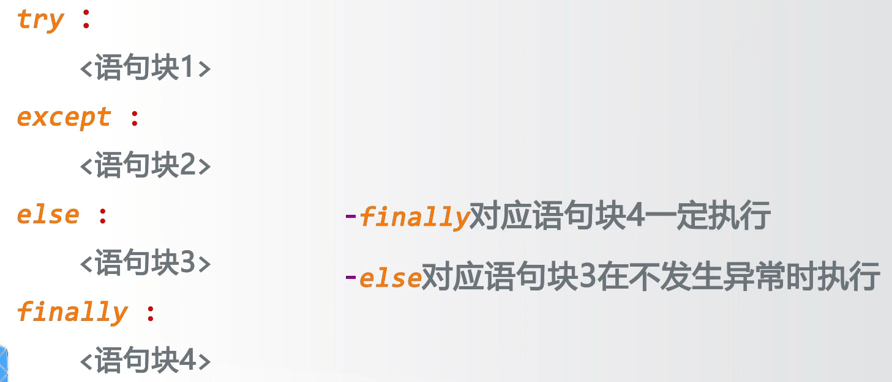

# 程序的分支结构
---
### 二分支结构
##### 一般形式
```python{class=line-numbers cmd=True}
guess = eval(input())
if guess == 99: # guess == True 表示其一定会被执行
    print("Right")
else:
    print("Wrong")
```
##### 紧凑形式
```python{class=line-numbers cmd=True}
guess = 50
print("You are {}".format("right" if guess==99 else "wrong"))
```
### 多分支结构
if elif else

### 异常处理

例如：处理输入异常的情况

[注] NameError 等是Python内部定义的异常类型，无需二次定义
##### 异常的高级处理方式
