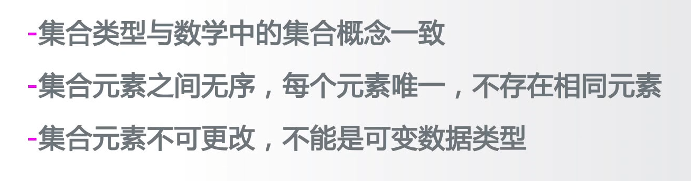
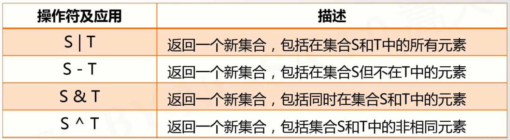
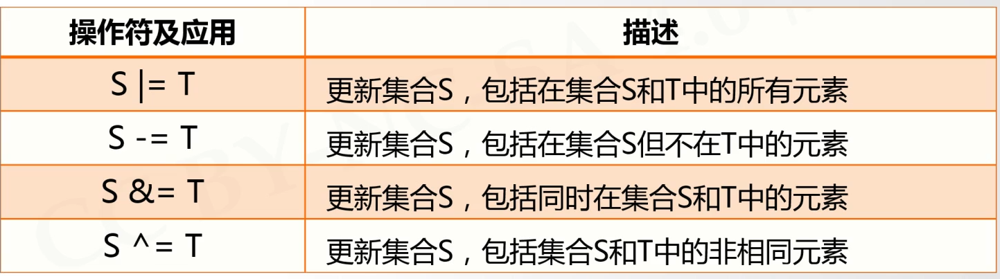
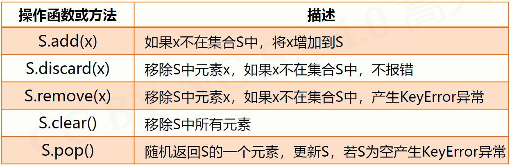
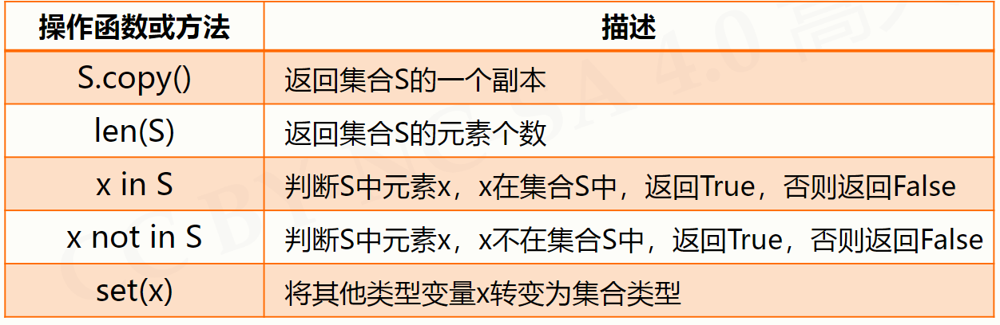
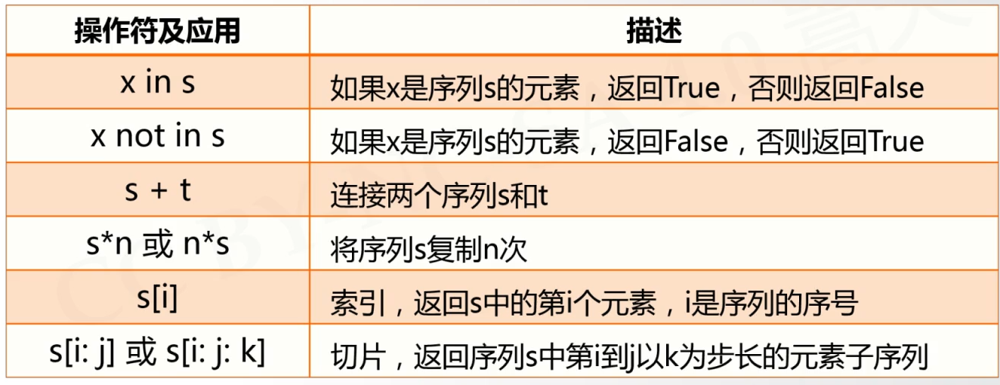
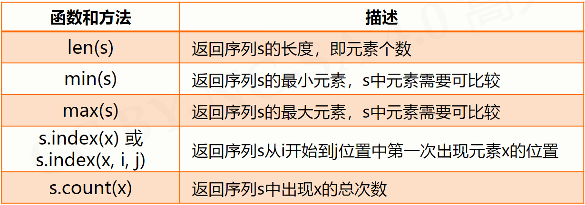
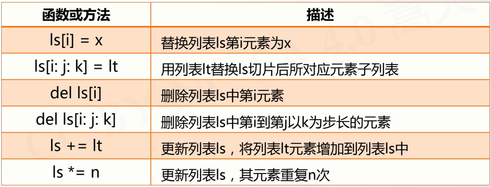
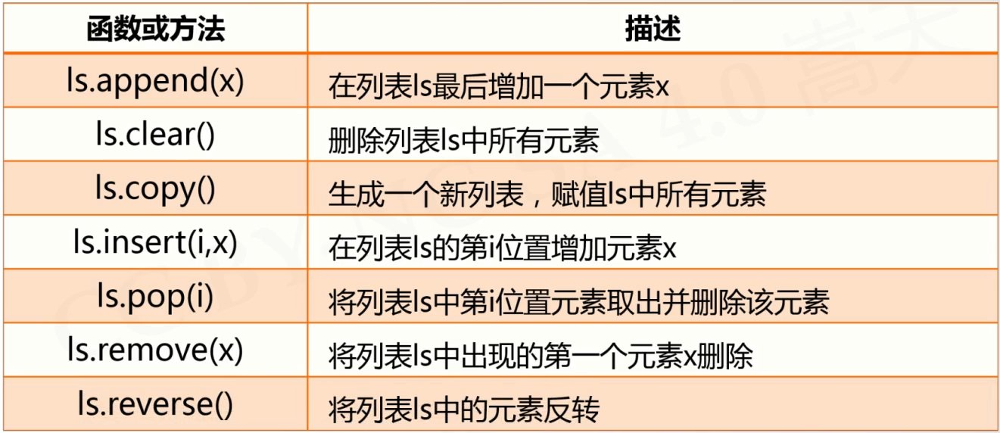
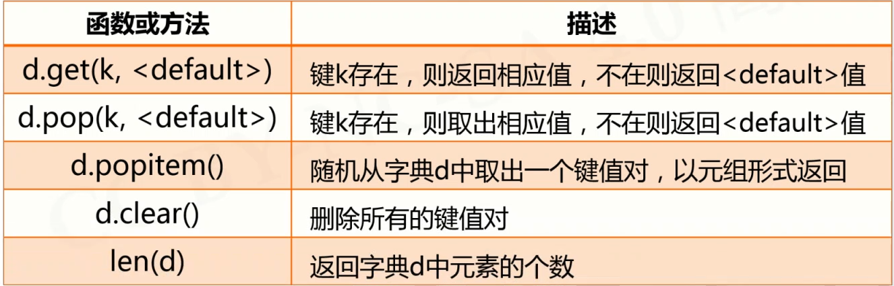

# 组合数据类型
---
### 集合

*[注]非可变数据类型：整数，浮点数，字符串，元组*

#### 生成方式
1.使用{}建立集合,**但是不能用来创建空集合,因为{}只用来创建字典类型**
> A= {"python",123,("python",123)}

此时得到的集合为{"python",123,("python",123)}

2.使用set建立集合
> B=set("pypy123")

此时得到的集合为{'1','p','2','3','y'} #删去相同的p

#### 操作符



#### 集合的处理方法


例如：下面两种方式可以遍历整个集合
```python{class=line-numbers cmd=True}

A = {"Hello","AI","World"}
for item in A:
    print(item)

try:
    while True:
        print(A.pop())
except:
    pass

```

#### 集合的应用场景
**1.数据去重**
利用set函数创造集合，去掉重复部分
利用list函数能把转换后的集合重新变成列表
```python{class=line-numbers cmd=True}
ls = ['p','p','y','y','1','2','3']
A = set(ls) 
print(A)
ls = list(A)
print(ls)
```
------
### 序列
>序列是具有先后关系的一组元素
>序列类型分为==字符串/元组/列表==
#### 序列类型的通用操作符

#### 序列类型的通用函数


### 元组类型
>1.元组类型是一种序列类型,一旦创建就不能够被修改
>2.使用小括号或者tuple()进行创建,元素之间用逗号分割
>3.可以使用或者不使用小括号
>4.元组类型可以用于保护数据

例如:函数的多个返回值在函数内部认为只返回了一个元组值
``` python{class=line-numbers}
def function():
    return 1,2
```
如上,其返回的是元组类型(1,2)

``` python{class=line-numbers cmd=True}
creature = "cat","tiger","dog","turtle"
print(creature[::-1])
color = (0x001100,"blue",creature)
print(color[-1][2]) #连续索引
```
### 列表类型
>列表是一种元组类型,创建后可以被随意修改
>使用方括号[]或者list()创建,元素之间用逗号分隔
>列表中各个元素类型可以不同,没有长度限制
``` python{class=line-numbers cmd=True}
ls = ["cat","tiger","dog","turtle"]
print(ls)
lt = ls
print(lt) 
ls[1] = "Hello"
print(lt) 
```
*[注]只有使用方括号[]和list()函数创建的列表才是一个新列表,采用赋值语句的创建的列表和原列表是同一个列表*
#### 列表操作函数

**此外:sorted()函数可用于排序**
``` python{class=line-numbers cmd=True}
ls = ["cat","tiger","dog","turtle","Human"]
print(ls)
lt = ["Hello","AI"]
ls[1:2] = lt
print(ls) 
del ls[1]
print(ls)
del ls[::2]
print(ls)
ls += lt
ls *= 2
print(ls)
```

#### 列表操作方式
 

------
### 字典
>字典类型是"映射"的体现
>字典是键值对的集合,键值对之间无序(键值对:键是数据索引的拓展)

#### 生成方式
>采用大括号{}或者dict()创建,键值对用冒号:表示
{<键1>:<值1>,<键2>:<值2>,<键3>:<值3>,...,<键n>:<值n>}
``` python{class=line-numbers cmd=True}
d = {"China":"Beijing","America":"Huston","France":"Bali"}
print(d)
print(d["China"])
de = {}
print(type(de))
```
**注:type(x)用于返回变量x的类型**

#### 字典类型操作

|操作|用途|
|----|----|
| x in d | 返回True或者False用于判断x是否在字典d中|
|d.keys()| 以字典类型返回字典d中的键|
|d.values()| 以字典类型返回字典d中的值|
|d["a"]=1| 向字典d中新增键值对元素或者修改原有键值对|

